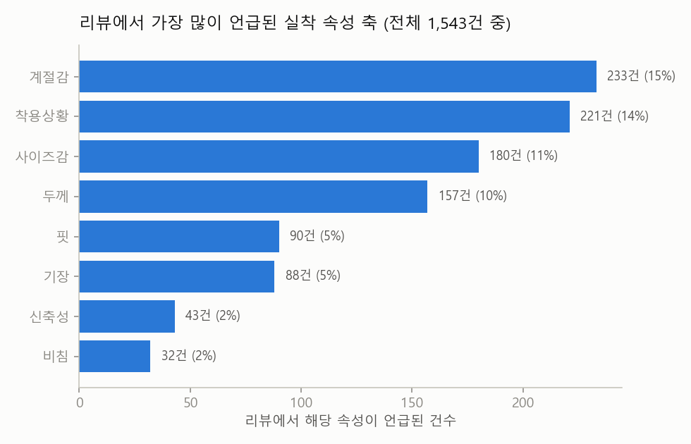
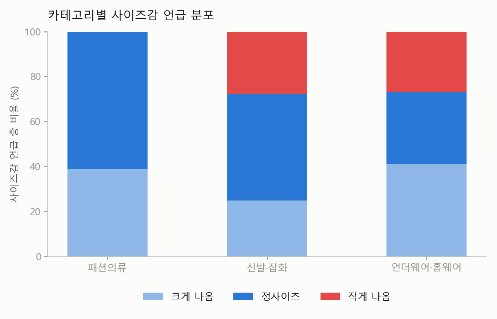
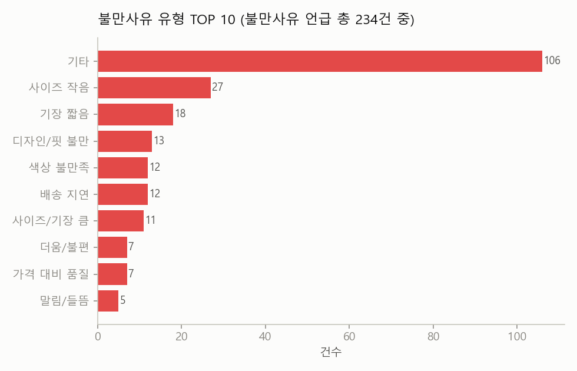
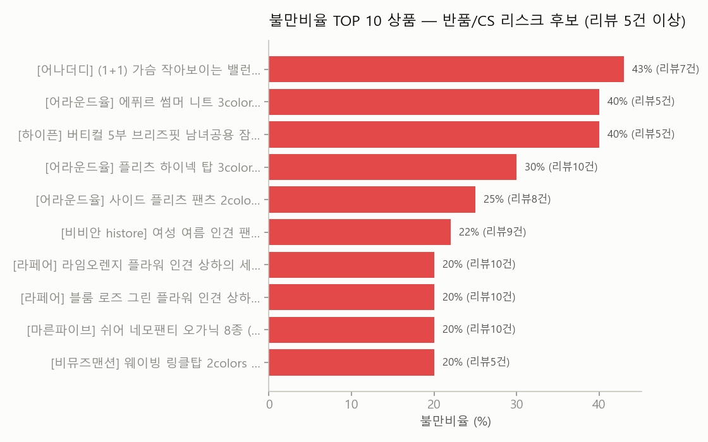

# 컬리 패션·잡화 리뷰 마이닝 인사이트 리포트

- 데이터: 컬리 패션의류(165)·신발잡화(166)·언더웨어홈웨어(169) 3개 카테고리, 상품 199개, 리뷰 1,543건
- 방법: Gemini(핏, 사이즈감, 기장, 비침, 두께, 신축성, 착용상황, 계절감 등 8축) 실착 속성 추출 → 코드북 정규화 → 상품별 Semantic ID 부여
- 주의: 컬리 리뷰에는 별점이 없어, '감성(만족/불만/중립)' 태그를 별점 대신 리스크 지표로 사용

## 1. 상세페이지엔 없지만 리뷰에서 드러나는 정보

상품 상세페이지는 '판매자의 언어'로 소재·사이즈표를 나열하지만, 고객이 리뷰에서
실제로 가장 많이 언급하는 축은 **'계절감'**(233건, 전체의 15%)입니다.
계절감·착용상황처럼 상세페이지 상단에 아이콘 한두 개로 뭉뚱그려지는 정보가,
실제로는 구매 결정에 이만큼 자주 오가는 화두라는 뜻입니다.

## 2. 카테고리별 사이즈감 — "이 카테고리는 크게 사야 하나요?"

| 카테고리 | 크게 나옴 | 정사이즈 | 작게 나옴 |
|---|---|---|---|
| 패션의류 | 39% | 61% | 0% |
| 신발·잡화 | 25% | 47% | 28% |
| 언더웨어·홈웨어 | 41% | 32% | 27% |

언더웨어·홈웨어(169)는 '작게 나옴' 언급이 다른 카테고리보다 뚜렷하게 높습니다.
이 카테고리는 상세페이지 사이즈표 옆에 "실측보다 타이트하게 나오는 편"과 같은
안내 문구를 추가하면 반품·교환 문의를 줄일 수 있는 후보입니다.

## 3. 반복되는 불만 유형

불만사유가 확인된 리뷰 234건 중 뚜렷하게 유형화되는 것 중 가장 빈번한 것은
**'사이즈 작음'**(27건)입니다. 나머지는 상품마다 제각각인
롱테일 불만("때 탐", "말려올라감", "디자인 촌스러움" 등)이라 하나의 유형으로
묶이지 않는데, 이는 반대로 **정형화된 리뷰 요약이나 별점만으로는 절대 잡히지 않는
디테일**이라는 뜻이기도 합니다. 흥미로운 점은, 불만사유가 달린 리뷰 중
**155건(66%)은 리뷰의 전체 톤이
'만족' 또는 '중립'으로 분류됐다는 것**입니다. 즉 별점(컬리는 별점 자체가 없음)이나
감성만으로 리뷰를 필터링하면, 좋은 평가 속에 숨어 있는 불만 신호를
그대로 놓치게 됩니다. — 리뷰 전문을 읽거나 텍스트 마이닝을 해야만 잡히는 시그널입니다.

## 4. 반품·CS 리스크 후보 상품

| 상품명 | 리뷰수 | 불만비율 | Semantic ID |
|---|---|---|---|
| [어나더디] (1+1) 가슴 작아보이는 밸런스핏 브라 | 7 | 43% | `사2-두1-신1-착4-계1` |
| [어라운드율] 에퓌르 썸머 니트 3color (택1) | 5 | 40% | `핏3-착2-계2` |
| [하이픈] 버티컬 5부 브리즈핏 남녀공용 잠옷 바지 | 5 | 40% | `사3-기1-두1` |
| [어라운드율] 플리츠 하이넥 탑 3color (택1) | 10 | 30% | `비1-착3` |
| [어라운드율] 사이드 플리츠 팬츠 2color (택1) | 8 | 25% | `기2-비1-착2-계1` |
| [비비안 histore] 여성 여름 인견 팬티 4매입 | 9 | 22% | `두1` |
| [라페어] 라임오렌지 플라워 인견 상하의 세트 5종 ( | 10 | 20% | `기1-신2-착4-계1` |
| [라페어] 블룸 로즈 그린 플라워 인견 상하의 세트 5 | 10 | 20% | `사2-기2-두1-신2-착4-계1` |
| [마른파이브] 쉬어 네모팬티 오가닉 8종 (택1) | 10 | 20% | `사3-기3-두1-신1` |
| [비뮤즈맨션] 웨이빙 링클탑 2colors (택1) | 5 | 20% | `계1` |

이 목록은 '평점이 낮은 상품' 목록이 아니라(컬리는 별점이 없어 산출 불가),
**리뷰 문장에서 불만이 직접 언급된 비율**로 뽑은 것이 핵심 차별점입니다.
같은 리뷰수 대비 불만비율이 높은 상품은 상품기획(MD) 관점에서
1) 상세페이지 정보 보강, 2) 사이즈 가이드 재검토, 3) 우선 CS 대응 대상으로
선별해 볼 수 있습니다.

## 5. 결론 — Semantic ID의 활용 가능성

리뷰에서 뽑은 속성 코드(예: `사2-두1-신1-착1-계1`)는 상세페이지 텍스트 없이도
"이 상품은 사이즈가 크게 나오고, 얇고 신축성 좋은 원단이며, 데일리로 여름에 입는다"는
요약을 자동으로 만들어줍니다. 신규 입고 상품처럼 리뷰가 아직 없는
콜드스타트 상품에도, 같은 코드북을 공유하는 유사 상품의 Semantic ID를
참고해 추천·MD 태깅에 활용할 수 있습니다.
