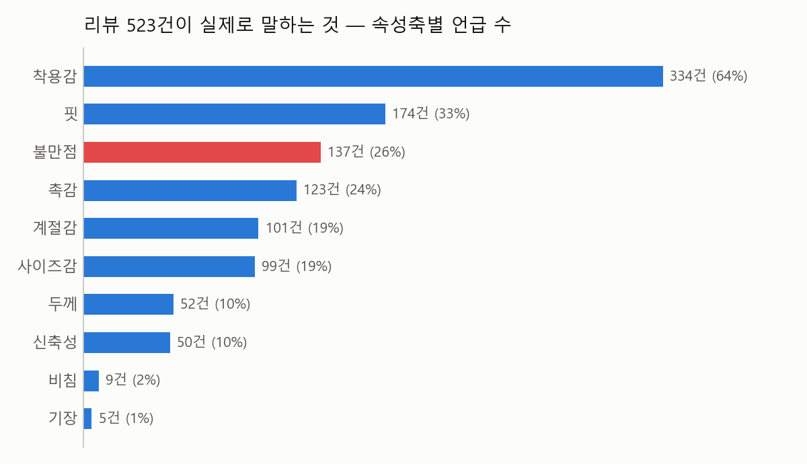
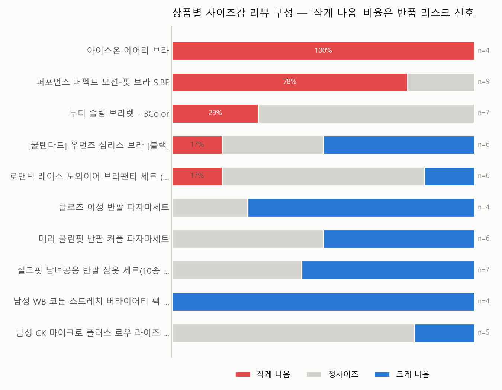
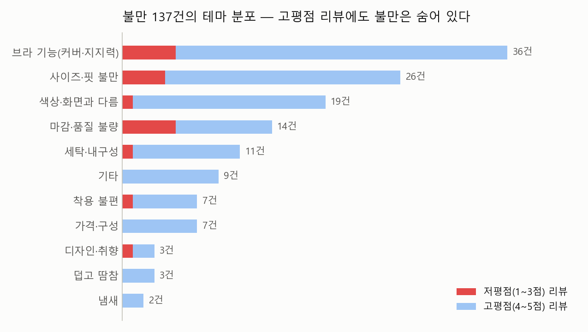
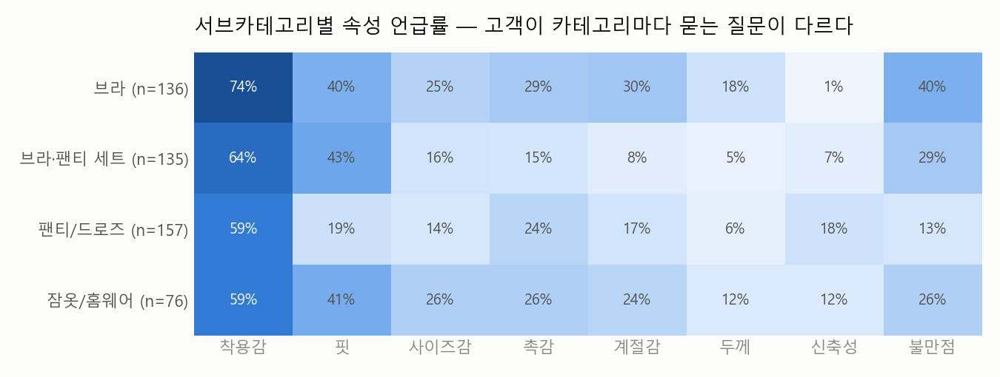

# 리뷰 마이닝 기반 속성 코드북 & 인사이트 리포트
### 무신사 속옷/홈웨어(026) · 리뷰 523건 · 상품 37개

> **문제의식** — 상품 상세페이지는 '판매자의 언어'로 쓰여 있다. 쿨링, 심리스, 프리미엄 코튼.
> 그러나 구매를 결정짓고 반품을 만들어내는 것은 '고객의 언어'다: *"컵이 작아요", "빨면 색이 빠져요", "흰 티 안에 입기 좋아요".*
> 이 리포트는 리뷰에서 실착 속성을 구조화 추출해 **속성 코드북**을 만들고, 상품마다 **Semantic ID**를 부여한 뒤,
> 평점·상세페이지만으로는 보이지 않는 신호를 MD 관점에서 정리한 것이다.

**파이프라인**: 리뷰 수집(무신사) → LLM 속성 추출(Gemini Flash, 리뷰당 10개 축) → 동의어 정규화로 코드북 구축 → 상품별 최빈 속성 집계로 Semantic ID 부여 → 인사이트 집계

---

## 요약 (TL;DR)

1. **고객 언어의 1순위는 '착용감'(리뷰의 64%)** — 상세페이지가 소재·디자인 중심으로 말하는 동안, 고객은 편안함을 산다.
2. **불만 137건 중 119건(87%)이 4~5점 리뷰 안에 있다** — 평점 모니터링만으로는 리스크의 9할을 놓친다.
3. **'작게 나옴' 시그널이 쏠린 상품이 존재** — 쿨링 브라 2종은 사이즈감 리뷰의 78~100%가 "작게 나옴". 반품 리스크 최우선 관리 대상.
4. **카테고리마다 고객이 묻는 질문이 다르다** — 브라는 착용감·계절감, 팬티는 신축성, 잠옷은 사이즈·촉감. 상세페이지 정보 우선순위도 달라야 한다.

---

## 1. 리뷰가 실제로 말하는 것 — 속성축별 언급률



- **착용감(64%)이 압도적 1위.** 핏(33%), 촉감(24%)이 뒤를 잇는다. 반면 상세페이지가 강조하는 정보와 겹치는 축(두께, 신축성)은 10% 수준.
- 분석 대상 37개 상품명을 보면 '쿨/시원/아이스' 계열 키워드 10회, '심리스/노와이어' 8회 — **판매자는 기능을 말하고, 고객은 경험을 말한다.**
- **사이즈감은 19%가 언급하지만, 저평점(1~3점) 리뷰에서는 언급률이 40%로 뛴다** (고평점 18%). 사이즈 실패가 낮은 평점의 주요 배경이라는 뜻이다.

> **MD 액션**: 상세페이지에 실측 정보 외에 **리뷰 기반 사이즈감 요약**("구매자 34%가 정사이즈, 23%가 작게 나옴")을 노출하면 사이즈 실패형 저평점·반품을 줄일 수 있다.

### 상세페이지에 없는 보너스 신호 — 착용 상황
리뷰에서만 나오는 구매 맥락: 데일리(19) · 수면(13) · **운동(12) · 필라테스(2)** · 흰티 착용(2) · 새깅/로우라이즈(2).
일반 브라렛이 운동용으로, 베이직 팬티가 특정 스타일링(새깅)용으로 팔리고 있다 — **수요가 온 곳을 알면 크로스셀 문구와 기획전 매핑이 달라진다.**

---

## 2. 상품별 사이즈감 구성 — 반품 리스크 조기 신호



사이즈감 언급이 4건 이상인 10개 상품만 비교한 결과:

| 상품 | "작게 나옴" 비율 | 해석 |
|---|---|---|
| 아이스온 에어리 브라 | **100%** (4/4) | 사이즈감 리뷰 전원이 "작다" |
| 퍼포먼스 퍼펙트 모션-핏 브라 | **78%** (7/9) | 스포츠 브라 특성 감안해도 과도 |
| 누디 슬림 브라렛 | 29% (2/7) | 저평점 리뷰도 이 상품에 집중(4건) |
| 남성 트렁크/파자마 5종 | 0% | 오히려 "크게 나옴" 우세 |

- **쿨링/스포츠 브라 2종에 "작게 나옴"이 집중.** 같은 브라여도 심리스 브라는 17%에 그쳐, 카테고리 공통이 아니라 **상품 고유의 패턴 문제**로 보인다.
- 남성 트렁크·파자마는 반대로 "크게 나옴"이 우세 — 성별/카테고리별로 사이즈 가이드의 보정 방향이 달라야 한다.

> **MD 액션**: ① 해당 2종은 사이즈 가이드에 "한 치수 업 권장" 문구 추가(또는 패턴 수정 협의), ② 리뷰 답변/Q&A에 선제 안내, ③ 반품 사유 데이터와 교차 검증.

---

## 3. 불만 테마 분석 — 평점이 가려버리는 리스크



이 데이터의 평균 평점은 4.79, 5점 비율 85%다. 평점만 보면 아무 문제가 없다. 그러나:

- **불만 언급 137건 중 119건(87%)이 4~5점 리뷰에서 나왔다.** "만족하지만 ~는 아쉽다"형 리뷰가 리스크 신호의 본체라는 뜻. 저평점 리뷰만 모니터링하는 운영 방식으로는 이 신호의 9할을 놓친다.
- **1위 테마는 브라 기능(커버·지지력) 36건** — "패드가 돌아간다", "가슴 옆이 뜬다", "잡아주는 맛이 없다". 상세페이지 스펙 어디에도 없는, 오직 실착에서만 나오는 정보다.
- **3위 색상·화면과 다름 19건**은 대부분 고평점 리뷰 속에 있다 — 제품 문제가 아니라 **상품 이미지 색보정 운영 이슈**로, 개선 비용 대비 효과가 가장 빠른 항목.
- 저평점 리뷰 내 불만 언급률은 72%로 고평점(24%)의 3배 — 불만 테마가 2개 이상 겹치는 리뷰(예: 사이즈 실패 + 마감 불량)가 저평점으로 전환되는 경향.

> **MD 액션**: ① 고평점 리뷰 포함 전체 리뷰에 불만 태깅 파이프라인 적용(본 프로젝트 방식), ② 브라 카테고리는 "지지력/커버" 관련 스펙 표기 신설 검토, ③ 색상 관련 불만 다발 상품은 상품 이미지 재촬영/보정 기준 정비.

---

## 4. 서브카테고리별 속성 언급률 — 고객의 질문은 카테고리마다 다르다



- **브라**: 착용감(74%)·불만점(40%)·계절감(30%) 모두 최고치. 구조물(와이어·패드)이 있는 카테고리라 실착 정보 수요가 가장 크고, 여름 쿨링 수요와 직결.
- **팬티/드로즈**: 신축성 언급(18%)이 브라(1.5%)의 12배. 이 카테고리 고객의 품질 판단 기준은 신축성이다.
- **잠옷/홈웨어**: 사이즈감(26%)·촉감(26%) 언급이 상대적으로 높음 — 선물 수요가 섞여 있어 사이즈 실패 비용이 큰 카테고리.
- **브라·팬티 세트**: 핏(43%) 언급 최고 — "세트인데 팬티만 작다"류의 상하 사이즈 불일치 이슈가 반복됨.

> **MD 액션**: 상세페이지 정보 구조를 카테고리 공통 템플릿이 아니라 **카테고리별 우선순위**로: 브라=지지력·쿨링 실측, 팬티=신축성 데이터, 잠옷=실측 사이즈표 강화, 세트=상·하의 개별 사이즈 선택 옵션.

---

## 5. 산출물: 속성 코드북 & Semantic ID

**코드북** ([codebook_026.json](../data/codebook_026.json)) — 리뷰의 자유 표현 241개를 9개 축, 축당 2~5개 코드로 정규화:

```
핏:      1 밀착핏 · 2 여유핏 · 3 슬림/깔끔 · 4 미흡/부적합
착용감:   1 편안함 · 2 불편함
사이즈감: 1 정사이즈 · 2 크게 나옴 · 3 작게 나옴
촉감:    1 부드러움 · 2 질감/소재 · 3 시원함 · 4 까슬함
계절감:   1 여름용 · 2 계절안맞음 · 3 사계절     (외 두께·신축성·비침·기장)
```

**Semantic ID** ([product_semantic_ids.csv](../data/product_semantic_ids.csv)) — 상품별로 리뷰 최빈 속성을 집계해 부여 (언급 2회 미만 축은 미부여). 37개 중 29개 상품에 2개 축 이상 부여:

| 상품 | Semantic ID | 풀이 |
|---|---|---|
| 에센셜 에어리 링클 팬티 | `핏1-착1-사2-두1-신1-촉1-계1` | 밀착핏·편안함·크게 나옴·얇음·신축성좋음·부드러움·여름용 |
| 아이스온 에어리 브라 | `핏1-착1-사3-두1-촉3-계1` | 밀착핏·편안함·**작게 나옴**·얇음·시원함·여름용 |
| 메리 클린핏 커플 파자마 | `핏2-착1-사2-두1-신2-촉1-계1` | 여유핏·편안함·크게 나옴·얇음·신축성없음·부드러움·여름용 |

같은 "여름 쿨링" 상품군이라도 사이즈감 코드(사2 vs 사3)가 갈린다 — 상세페이지가 담지 못하는 리뷰 기반 차별 정보가 코드 한 줄에 압축된다.
**활용**: 신상품은 리뷰가 없어도 상품 설명 텍스트에서 같은 축을 추출해 Semantic ID를 부여하면, 기존 상품과의 속성 유사도로 **콜드스타트 추천**이 가능하다 (5단계 데모에서 시연).

---

## 한계와 유의점

- **표본**: 상품당 리뷰 최대 20건 크롤링 상한 → 비율 수치는 방향성 지표로 볼 것. 사이즈감 상품별 분석은 언급 4건 이상 상품만 포함했으나 여전히 n이 작다 (차트에 n 표기).
- **평점 편중**: 5점 85% 데이터라 저평점 기반 수치(25건)는 건수가 작다. 그래서 본 리포트는 "저평점 내 비율"과 "고평점 속 불만"을 함께 봤다.
- **LLM 추출 오류**: 검수에서 긍정 문장이 불만으로 태깅된 사례 2~3건 확인(예: "등살도 튀어나오지 않고 잘 잡아주네요"). 전체 규모 대비 결론을 바꾸는 수준은 아니나, 실서비스라면 추출 후 검증 단계가 필요하다.
- **불만 테마 분류**는 키워드 규칙 기반(137건 중 기타 9건) — 규모가 커지면 LLM 분류로 대체 권장.

---

*파이프라인 코드: [extract_attributes.py](../extract_attributes.py) · [build_codebook.py](../build_codebook.py) · [assign_semantic_id.py](../assign_semantic_id.py) · [analyze_insights.py](../analyze_insights.py)*
